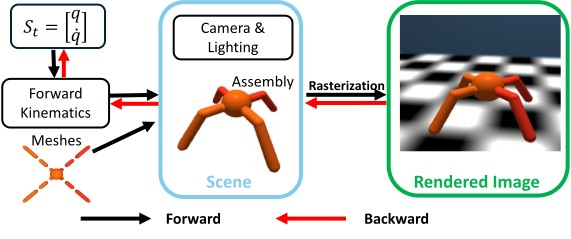

# Differentiable Rendering for Robot Learning
This repository offers differentiable rendering tools specifically designed for robotic learning applications.

An example of using this software to train a visual policy end-to-end is available [here](https://github.com/HaoxiangYou/D.VA).

If you use this repo in your research, please consider citing the paper as follows:

```
@misc{you2025acceleratingvisualpolicylearningparallel,
      title={Accelerating Visual-Policy Learning through Parallel Differentiable Simulation}, 
      author={Haoxiang You and Yilang Liu and Ian Abraham},
      year={2025},
      eprint={2505.10646},
      archivePrefix={arXiv},
      primaryClass={cs.LG},
      url={https://arxiv.org/abs/2505.10646}, 
}
```

## Installation

- `git clone https://github.com/HaoxiangYou/torch3d_robo.git`

- In the project folder, create a virtual environment in Anaconda:

  ```
  conda env create -f robo3d.yml
  conda activate robo3d
  ```

- Build pytorch3d (only required for SHAC baseline)
  ```
  # Use a prebuilt version of PyTorch3D compatible with PyTorch 2.5.1 and CUDA 12.4
  pip install pytorch3d==0.7.8+pt2.5.1cu124 --extra-index-url https://miropsota.github.io/torch_packages_builder
  ```

## Instruction

- Run test code by 
  ```
  python test_scripts/test_ant.py 
  ```

## Methods

Our method is built on top of `PyTorch3D`, with a kinematics tree implemented in `PyTorch` to support differentiable image-to-state gradients.
The computational graph is summarized in the figure below:

<p align="center">
  
</p>

## Acknowledgement

We refer the [pytorch_kinematics](https://github.com/UM-ARM-Lab/pytorch_kinematics) , developed by the Autonomous Robotic Manipulation Lab at the University of Michigan, Ann Arbor, to construct the `forward kinematics tree`.
We also make several key modifications to support floating-base systems and multiple joints definition under single link.